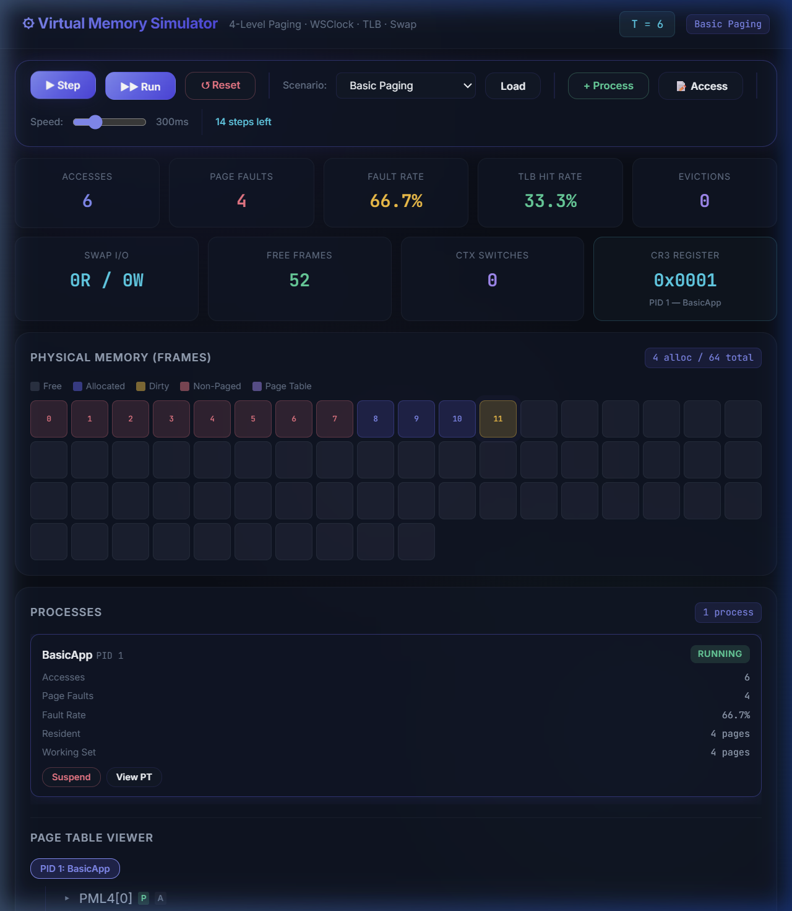

# ⚙ Virtual Memory Simulator

> An interactive, web-based virtual memory management simulator that models real-world x86-64 operating system mechanics — including 4-level page tables, TLB caching, demand paging, the WSClock page replacement algorithm, swap space management, and thrashing detection — all visualised through a rich, real-time dashboard.



---

## Table of Contents

- [Overview](#overview)
- [Features](#features)
- [Architecture](#architecture)
- [Tech Stack](#tech-stack)
- [Getting Started](#getting-started)
  - [Prerequisites](#prerequisites)
  - [Installation](#installation)
  - [Running the Simulator](#running-the-simulator)
- [Usage Guide](#usage-guide)
  - [Loading a Scenario](#loading-a-scenario)
  - [Step-by-Step Execution](#step-by-step-execution)
  - [Auto-Run Mode](#auto-run-mode)
  - [Manual Memory Access](#manual-memory-access)
  - [Process Management](#process-management)
- [Built-in Scenarios](#built-in-scenarios)
- [Dashboard Panels](#dashboard-panels)
- [Simulator Internals](#simulator-internals)
  - [4-Level Page Table](#4-level-page-table)
  - [Translation Lookaside Buffer (TLB)](#translation-lookaside-buffer-tlb)
  - [Memory Management Unit (MMU)](#memory-management-unit-mmu)
  - [WSClock Page Replacement](#wsclock-page-replacement)
  - [Swap Space Manager](#swap-space-manager)
  - [Thrashing Detection](#thrashing-detection)
- [REST API Reference](#rest-api-reference)
- [Project Structure](#project-structure)
- [Configuration](#configuration)
- [License](#license)

---

## Overview

This simulator is designed to help students, educators, and OS enthusiasts **understand how modern operating systems manage virtual memory**. Rather than reading about abstract concepts, users can watch them unfold in real time — seeing TLB lookups resolve, page faults trigger demand-zero allocations or swap-ins, the WSClock hand sweep through the frame ring, and thrashing emerge when working sets exceed physical memory.

The simulator uses a **scaled-down address space** (8-bit virtual page numbers with 4 KB pages) so that page tables and memory maps remain visualisable, while maintaining the same structural principles as real x86-64 4-level paging.

---

## Features

### Core Simulation
-  **4-Level Hierarchical Page Tables** — PML4 → PDPT → PD → PT, modelled after x86-64 paging with lazy intermediate table allocation
-  **Translation Lookaside Buffer (TLB)** — Fully-associative, LRU-eviction cache with per-process flushing on context switches
-  **Memory Management Unit (MMU)** — Full address translation pipeline: TLB lookup → page table walk → page fault handling
-  **Demand Paging** — Pages are allocated on first access (demand-zero) with no pre-loading
-  **WSClock Page Replacement** — Working Set Clock algorithm combining working-set theory with second-chance scanning, closely modelling Windows NT's memory manager
-  **Swap Space Management** — Fixed-size swap partition with slot allocation, dirty page write-back, and swap-in on re-access
-  **Thrashing Detection** — Sliding-window page-fault-rate monitor with configurable thresholds and actionable recommendations
-  **Process Management** — Multi-process support with named memory regions (code, heap, stack), process suspension/resumption, and CR3 register tracking
-  **Context Switching** — Automatic TLB flushing and CR3 register updates when switching between processes

### Dashboard & Visualisation
-  **Real-Time Statistics** — Accesses, page faults, fault rate, TLB hit rate, evictions, swap I/O, free frames, and context switches
-  **Physical Memory Map** — Color-coded frame grid showing free, allocated, dirty, non-paged (kernel), and page-table frames
-  **Swap Space Visualisation** — Grid view of swap slot utilisation
-  **WSClock Ring Visualisation** — Clock hand position and ring contents
-  **Process Cards** — Per-process stats including working set size, resident pages, fault rate, and state
-  **Page Table Viewer** — Interactive tree view of the 4-level page table hierarchy with PTE flags (Present, Accessed, Dirty, R/W, NX)
-  **Performance Charts** — Real-time page fault rate and TLB hit rate plotted over simulation time
-  **Event Log** — Detailed, color-coded log of every simulation event (TLB hits/misses, page walks, page faults, evictions, swap I/O, context switches)
-  **Thrashing Alert Banner** — Real-time banner with remediation recommendations when thrashing is detected

---

## Architecture

```
┌─────────────────────────────────────────────────────────────┐
│                     Web Dashboard (Browser)                  │
│  index.html  ·  style.css  ·  app.js                        │
│  Real-time stats, memory map, page table viewer, charts     │
└────────────────────────┬────────────────────────────────────┘
                         │  REST API (JSON)
                         ▼
┌─────────────────────────────────────────────────────────────┐
│                   Flask Application (app.py)                 │
│  Routes: /api/state · /api/step · /api/access · /api/reset  │
│          /api/process/* · /api/scenario/* · /api/log         │
└────────────────────────┬────────────────────────────────────┘
                         │
                         ▼
┌─────────────────────────────────────────────────────────────┐
│               Simulation Engine (engine.py)                  │
│  Orchestrator: owns all subsystems, drives step execution,  │
│  scenario loading, state serialisation                       │
└───┬────┬────┬────┬────┬────┬────┬────┬──────────────────────┘
    │    │    │    │    │    │    │    │
    ▼    ▼    ▼    ▼    ▼    ▼    ▼    ▼
  MMU  TLB  Page  Frame Swap  WS   Thrash  Process
             Table Table Mgr  Clock Detect  Manager
              (4L)                          & Stats
```

---

## Tech Stack

| Layer       | Technology       |
|-------------|------------------|
| **Backend** | Python 3.10+, Flask |
| **Frontend** | HTML5, Vanilla CSS, Vanilla JavaScript |
| **Data**    | JSON (scenarios & API) |
| **Charts**  | HTML5 Canvas (custom) |

> No npm, no build step, no external JS frameworks — just Python and a browser.

---

## Getting Started

### Prerequisites

- **Python 3.10+** (uses `match` syntax and modern type hints)
- **Flask** (`pip install flask`)

### Installation

1. **Clone the repository:**
   ```bash
   git clone https://github.com/yourusername/virtual-memory-simulator.git
   cd virtual-memory-simulator
   ```

2. **Install dependencies:**
   ```bash
   pip install flask
   ```
   That's it — Flask is the only external dependency.

### Running the Simulator

```bash
python app.py
```

The development server starts on **http://127.0.0.1:5000**. Open this URL in your browser to access the dashboard.

```
 * Serving Flask app 'app'
 * Debug mode: on
 * Running on http://127.0.0.1:5000
```

---

## Usage Guide

### Loading a Scenario

1. Click the **Scenario** dropdown in the control panel
2. Select one of the 6 built-in scenarios (e.g., "Basic Paging")
3. Click **Load** — the simulator resets and pre-configures processes + a queue of memory accesses

### Step-by-Step Execution

Click **▶ Step** to advance one tick at a time. Each step executes the next memory access in the scenario queue and updates all panels in real time. This is ideal for understanding exactly what happens during each access.

### Auto-Run Mode

Click **▶▶ Run** to automatically step through the scenario. Use the **Speed** slider (50ms – 1000ms) to control the pace. Click **⏸ Pause** to stop.

### Manual Memory Access

Click **📝 Access** to open the manual access modal, where you can specify:
- **PID** — the target process
- **VPN** — the virtual page number to access
- **Type** — read or write

This lets you explore "what-if" scenarios beyond the predefined access sequences.

### Process Management

- **+ Process** — Create a new process with default memory regions (code, heap, stack)
- **Suspend** — Suspend a process, paging out its entire working set to swap
- **Resume** — Resume a suspended process (pages will be demand-faulted back in)
- **View PT** — Expand the 4-level page table tree for the selected process

---

## Built-in Scenarios

| Scenario | Description |
|----------|-------------|
| **Basic Paging** | Single process with sequential and random accesses. Demonstrates basic demand-zero page faults, TLB behaviour, and page table walks. |
| **Context Switching** | Three processes (Editor, Compiler, Browser) alternate execution, triggering TLB flushes and demonstrating per-process page table isolation. |
| **Dirty Pages** | Heavy write workload with limited physical memory (24 frames). Shows how WSClock must write dirty pages to swap before eviction, preferring clean pages. |
| **Page Fault Storm** | A single process accesses more unique pages than available frames (24), causing continuous evictions and demonstrating frame pressure. |
| **Working Set Locality** | A process exhibits clear temporal locality phases — working on a small set of pages, then shifting to a new set, demonstrating working set transitions and TLB warm-up. |
| **Thrashing** | Three processes compete for only 16 usable frames, causing the page fault rate to exceed the thrashing threshold. Demonstrates thrashing detection and remediation recommendations. |

---

## Dashboard Panels

### 📊 Statistics Bar
Real-time counters: total accesses, page faults, fault rate, TLB hit rate, evictions, swap I/O (reads/writes), free frames, context switches, and the current CR3 register value.

### 🟦 Physical Memory Map
A grid of 64 frames, each color-coded:
- **Grey** — free
- **Indigo** — allocated
- **Amber** — dirty (modified)
- **Rose** — non-paged (kernel/pinned)
- **Violet** — page table page

Hover over any frame to see its owner (PID), virtual page mapping, and access metadata.

### 📋 Process Cards
Each process shows its PID, name, state (RUNNING / READY / SUSPENDED), access count, page faults, fault rate, resident pages, and working set size. Includes **Suspend** and **View PT** actions.

### 🌳 Page Table Viewer
An interactive tree that expands the 4-level hierarchy:
```
▸ PML4[0]  P A
  ▸ PDPT[0]  P A
    ▸ PD[0]  P A
      ▸ PT[0]  P A  → Frame 8
      ▸ PT[1]  P A  → Frame 9
```
Each entry shows flags: **P** (present), **A** (accessed), **D** (dirty), **R/W** (read/write), **NX** (no execute).

### 💾 Swap Space
Grid view of 128 swap slots showing free/used status. Below it, the **WSClock Algorithm** panel shows the clock ring, hand position, and eviction statistics (clean vs. dirty evictions).

### 📈 Performance Charts
Two real-time line charts rendered on HTML5 Canvas:
- **Page Fault Rate over Time** — with a thrashing threshold line
- **TLB Hit Rate over Time** — showing cache warm-up and cold-start effects

### 📜 Event Log
A scrolling log of every event with color-coded badges:
- 🟢 `TLB_HIT` — TLB cache hit
- 🔵 `TLB_MISS` — TLB miss, triggering page walk
- 🟣 `PAGE_WALK` — 4-level page table traversal with index path
- 🔴 `PAGE_FAULT` — demand-zero or swap-in fault
- 🟠 `EVICT` — frame evicted by WSClock
- 🔵 `SWAP_IN` / `SWAP_OUT` — swap space I/O
- 🟡 `CONTEXT_SWITCH` — process switch with TLB flush count

---

## Simulator Internals

### 4-Level Page Table

Modelled after x86-64 paging with scaled-down widths:

| Level | x86-64 Name | Bits | Entries |
|-------|-------------|------|---------|
| 0     | PML4        | 2    | 4       |
| 1     | PDPT        | 2    | 4       |
| 2     | PD          | 2    | 4       |
| 3     | PT (leaf)   | 2    | 4       |

**Total:** 2⁸ = 256 virtual pages per process.

Each Page Table Entry (PTE) carries standard x86-64 flags:
- `Present (P)` — page is resident in physical memory
- `Read/Write (R/W)` — writable if set
- `User/Supervisor (U/S)` — user-mode accessible
- `Accessed (A)` — set by MMU on any reference
- `Dirty (D)` — set by MMU on write
- `No Execute (NX)` — non-executable

Intermediate page tables are **lazily allocated** — only created when a mapping through that branch is first needed.

### Translation Lookaside Buffer (TLB)

- **Type:** Fully-associative
- **Size:** 16 entries (configurable)
- **Eviction:** LRU (Least Recently Used) via `OrderedDict`
- **Flushing:** Per-process entries flushed on context switch (models real PCID-less x86 behaviour)
- **Tracking:** Hit/miss counters and hit rate

### Memory Management Unit (MMU)

The MMU orchestrates the full translation pipeline:

```
TLB Lookup ──hit──→ Frame number (fast path)
     │
     miss
     ▼
Page Table Walk (4 levels)
     │
     ├── PTE present → Frame number, insert into TLB
     │
     └── PTE not present → PAGE FAULT
                               │
                               ├── swap_slot set → SWAP_IN
                               │
                               └── no swap_slot  → DEMAND_ZERO
                                        │
                                        ▼
                                   Allocate frame
                                   (evict if needed)
                                        │
                                        ▼
                                   Update PTE + TLB
```

### WSClock Page Replacement

The WSClock algorithm (Working Set Clock) combines the working set concept with clock scanning:

1. Maintains a **circular ring** of all allocated frames
2. On eviction, spins the clock hand:
   - **R-bit set** → clear it, update timestamp, advance
   - **R-bit clear + within τ window** → skip (page is in working set)
   - **R-bit clear + outside τ + clean** → **evict immediately** ✓
   - **R-bit clear + outside τ + dirty** → schedule write-back, advance
3. Fallback: after two full revolutions, pick the oldest dirty page

The working set window τ (tau) is configurable (default: 10 virtual-time units).

### Swap Space Manager

- **Capacity:** 128 slots (configurable)
- **Operations:** Allocate slot, free slot, read page, write page
- **Tracking:** Per-slot ownership (PID + VPN), I/O statistics
- Pages are written to swap on eviction if dirty, and read back on swap-in

### Thrashing Detection

Uses a **sliding-window page-fault-rate monitor**:

- **Window size:** 20 accesses (configurable)
- **Threshold:** 70% fault rate (configurable)
- When the fault rate exceeds the threshold, the system is flagged as thrashing
- The detector generates **actionable recommendations** (e.g., "Recommend suspending process X")

---

## REST API Reference

All API endpoints return JSON. The simulator is fully controllable via the REST API.

### Simulation Control

| Method | Endpoint | Description |
|--------|----------|-------------|
| `GET`  | `/api/state` | Get the complete simulation state |
| `POST` | `/api/step` | Advance one simulation tick |
| `POST` | `/api/access` | Execute a manual memory access |
| `POST` | `/api/reset` | Reset the simulator |

### Process Management

| Method | Endpoint | Description |
|--------|----------|-------------|
| `POST` | `/api/process/create` | Create a new process |
| `POST` | `/api/process/suspend` | Suspend a process |
| `POST` | `/api/process/resume` | Resume a suspended process |

### Scenarios

| Method | Endpoint | Description |
|--------|----------|-------------|
| `GET`  | `/api/scenarios` | List available scenarios |
| `POST` | `/api/scenario/load` | Load a scenario by filename |

### Logs & Timeline

| Method | Endpoint | Description |
|--------|----------|-------------|
| `GET`  | `/api/log?n=100` | Get the last N event log entries |
| `GET`  | `/api/timeline` | Get time-series data for charts |

#### Example: Manual Access

```bash
curl -X POST http://127.0.0.1:5000/api/access \
  -H "Content-Type: application/json" \
  -d '{"pid": 1, "vpn": 42, "type": "write"}'
```

---

## Project Structure

```
virtual-memory-simulator/
│
├── app.py                      # Flask web server & REST API routes
│
├── simulator/                  # Core simulation engine
│   ├── __init__.py
│   ├── config.py               # SimConfig — address geometry, memory sizes, thresholds
│   ├── engine.py               # SimulationEngine — top-level orchestrator
│   ├── mmu.py                  # MMU — address translation pipeline
│   ├── page_table.py           # 4-level hierarchical page table (PML4/PDPT/PD/PT)
│   ├── tlb.py                  # TLB — fully-associative LRU cache
│   ├── frame_table.py          # Physical frame table & free list management
│   ├── page_replacement.py     # WSClock page replacement algorithm
│   ├── swap_manager.py         # Swap space slot management & I/O simulation
│   ├── process.py              # Process abstraction, regions, & process manager
│   ├── thrashing_detector.py   # Sliding-window thrashing detector
│   └── statistics.py           # Centralised statistics collector & timeline
│
├── templates/
│   └── index.html              # Dashboard HTML template
│
├── static/
│   ├── style.css               # Dashboard styles (dark theme, glassmorphism)
│   └── app.js                  # Dashboard logic (rendering, API calls, charts)
│
├── scenarios/                  # Predefined simulation scenarios
│   ├── basic_paging.json
│   ├── context_switch.json
│   ├── dirty_pages.json
│   ├── page_fault_storm.json
│   ├── working_set.json
│   └── thrashing.json
│
├── screenshots/
│   └── dashboard.png           # Dashboard screenshot
│
└── README.md                   # This file
```

---

## Configuration

All simulation parameters are defined in `simulator/config.py` and can be overridden at runtime via the API or per-scenario:

| Parameter | Default | Description |
|-----------|---------|-------------|
| `page_size` | 4096 | Page size in bytes (4 KB) |
| `levels` | 4 | Number of page table levels |
| `bits_per_level` | [2,2,2,2] | Index bits per level (256 virtual pages total) |
| `total_frames` | 64 | Total physical frames |
| `non_paged_frames` | 8 | Pinned kernel frames (non-pageable) |
| `swap_slots` | 128 | Total swap space slots |
| `tlb_size` | 16 | TLB entry capacity |
| `working_set_window` | 10 | WSClock τ parameter (virtual-time units) |
| `thrashing_threshold` | 0.7 | Page fault rate to flag thrashing |
| `thrashing_window` | 20 | Sliding window size for fault rate |
| `swap_io_latency` | 3 | Simulated I/O latency in ticks |

---

## Creating Custom Scenarios

Create a JSON file in the `scenarios/` directory following this schema:

```json
{
  "name": "My Custom Scenario",
  "description": "Description shown in the scenario picker.",
  "config": {
    "total_frames": 32,
    "non_paged_frames": 4
  },
  "processes": [
    {
      "name": "MyApp",
      "regions": [
        { "name": "code",  "start_vpn": 0,  "end_vpn": 63,  "read_write": false, "no_execute": false },
        { "name": "heap",  "start_vpn": 64, "end_vpn": 191, "read_write": true,  "no_execute": true },
        { "name": "stack", "start_vpn": 192,"end_vpn": 255, "read_write": true,  "no_execute": true }
      ]
    }
  ],
  "accesses": [
    { "pid": 1, "vpn": 0, "type": "read" },
    { "pid": 1, "vpn": 64, "type": "write" }
  ]
}
```

The scenario will automatically appear in the dashboard dropdown on the next page load.

---

## License

This project is open source and available under the [MIT License](LICENSE).
